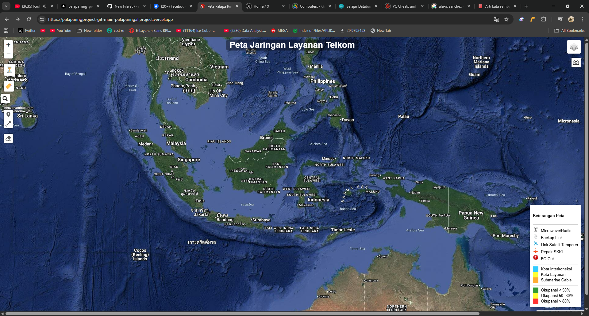
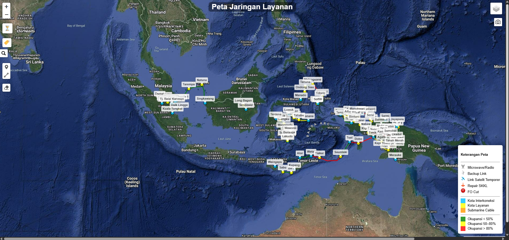
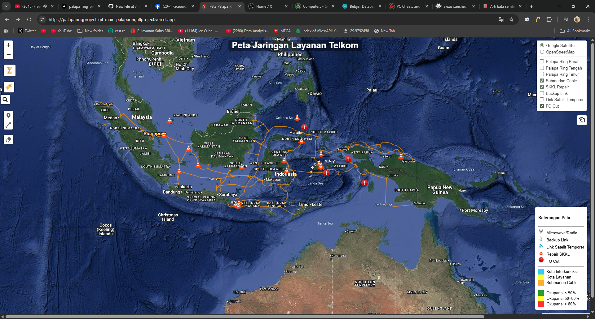
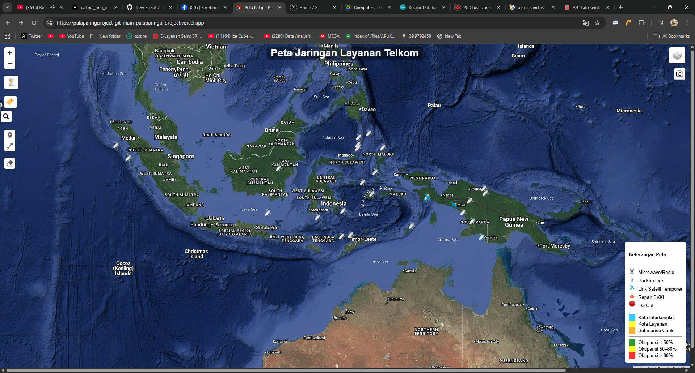
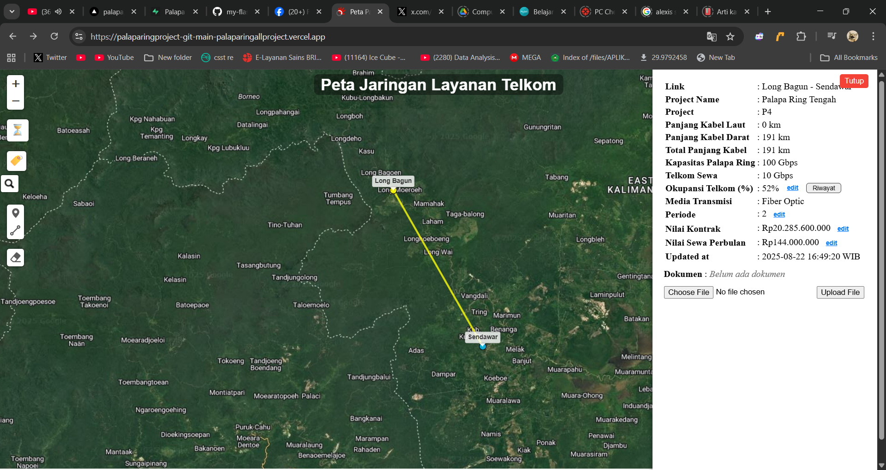
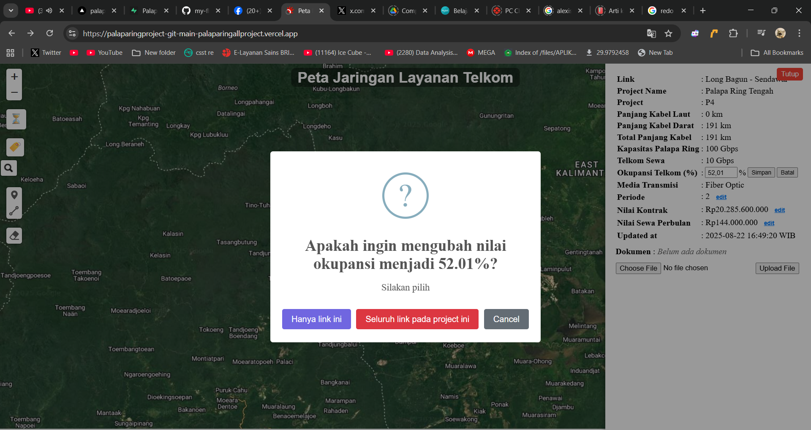
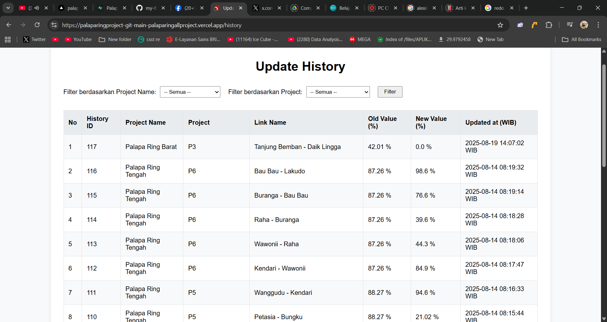
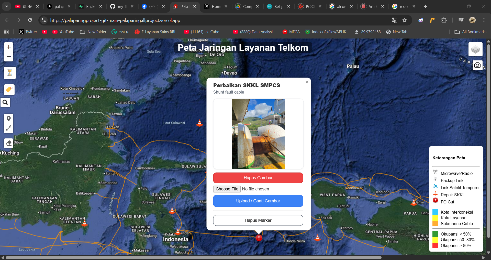
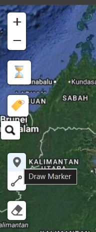
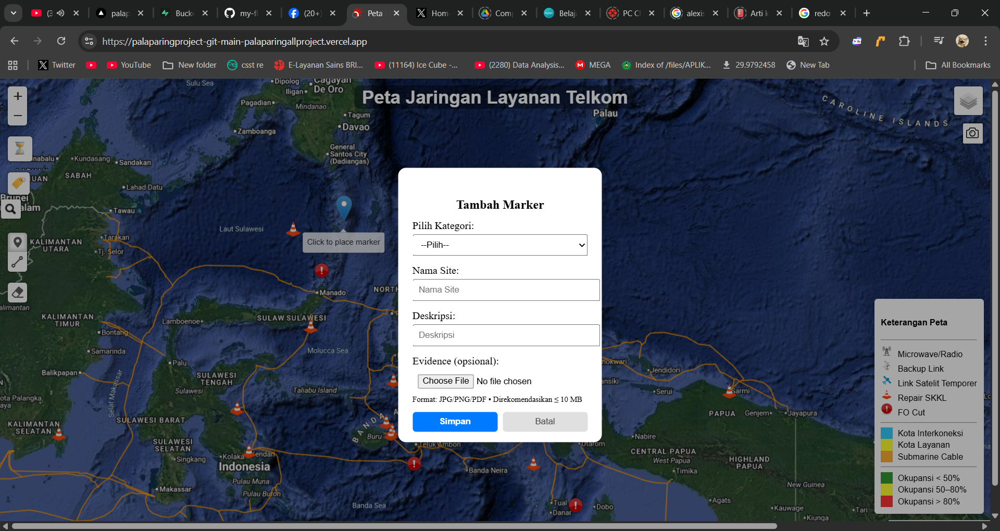

# Peta Jaringan Layanan Telkom Indonesia

Dashboard peta interaktif untuk memantau kondisi layanan milik Telkom Indonesia

>  Terakhir diperbarui: 2026-01-09 (WIB)

---

# USER MANUAL
## Library
- **Backend**
    1. Flask (Python web framework) + psycopg2 (PostgreSQL/Supabase) – menyajikan GeoJSON & endpoint update. 
- **Frontend**: 
    1. Leaflet 1.9.4 -- peta interaktif utama.
    2. leaflet-search 3.0.9 -- fitur cari layer di peta 
    3. leaflet-simple-map-screenshoter -- screenshot peta lalu export
    4. @geoman-io/leaflet-geoman-free 2.15.0 -- create dan edit marker
    5. leaflet.groupedlayercontrol 0.7.0 -- control layer pergrup (milih layer)
    6. SweetAlert2 11 -- pop up konfirmasi (muncul saat edit okupansi)
    7. @supabase/supabase-js v2 -- ext untuk upload document ke Supabase


## Dataset dan Storage
  
  1. Dataset disimpan di Supabase (SQL Cloude based database). 
  2. Kolom "geom" pada dataset memiliki tipe kolom *geometry*, sehingga perlu menginstall extension *postgis* kolom geom dapat digunakan sebagai titik koordinat. Berikut link untuk mengunduh postgis "https://postgis.net/". Pastikan extension postgis terinstall via SQL query dengan syntax: 

            - CREATE EXTENSION postgis;
        notes: Install extension postgis diperlukan di awal saja jika akan mengedit di database yang baru baik lokal maupun cloud. Jika tidak menginstall postgis maka kolom geom tidak akan ada pilihan tipe data "geometry" dan dataset tidak bisa digunakan

    
  3. Dataset yang digunakan terdiri dari beberaa tabel. Diantaranya
        1. Palapa_Ring_Barat_Point (Titik project Paring Barat)
        2. Palapa_Ring_Barat_Alur (Alur antar project Paring Barat)
        3. Palapa_Ring_Tengah_Point (Titik project Paring Tengah)
        4. Palapa_Ring_Tengah_Alur (Alur antar project Paring Tengah)
        5. Palapa_Ring_Timur_Point (Titik project Paring Timur)
        6. Palapa_Ring_Timur_Alur (Alur antar project Paring Timur)
        7. Backup Link (Layanan Satelit VSAT)
        8. Link_Satelit (Layanan Satelit VSAT)
        9. Palapa_Ring_FO_Cut (Lokasi fiber optic cut)
        10. SKKL_Repair_2025_BY_DCS (history titik perbaikan FO)
        11. SubmarineCable_Alur (Alur SKKL Telkom)
        12. e2_skkl (Titik akhir SKKL)
        13. skkl_repair (history titik perbaikan FO) (TIDAK DIGUNAKAN!)
  4. Syntax disimpan di Github "https://github.com/raihanr7/my-flask-app"

## ⚙️ Konfigurasi Database


# PostgreSQL (via Transaction pooler karena Vercel hanya compatibel dengan ini saja)
host=os.getenv('DATABASE_HOST'),
database=os.getenv('DB_NAME'),
user=os.getenv('DB_USER'),
password=os.getenv('DB_PASSWORD'),
port=os.getenv('DB_PORT'),
options='-c timezone=Asia/Jakarta -c pool_mode=transaction'


- **Fitur utama**: Layer Palapa Ring (Barat/Tengah/Timur), Submarine Cable, SKKL Repair, Backup Link, Link Satelit, FO Cut, E2E points; sidebar detail & edit Okupansi; History update.


## Hosting
**Vercel**
Peta online ini dihosting via "https://vercel.com/".


## Struktur Proyek
```
/app.py                   -- Flask app: route, render template, serve API.
/templates/
  |── layout.html         -- template dasar: load CSS/JS, block head/body.
  └── map.html            -- halaman peta (tombol add marker, sidebar, upload doc, history edit per project (paring only), dan load script .js lainnya)
/static/
  /css/map.css            -- styling peta, sidebar, kontrol, legenda.
  /js/                    
    baseLayers.js         -- basemap (Google Satellite, OSM).
    config.js             -- state global (layer groups, flags, BASE `/api`).
    controls.js           -- toggle label, tombol History, kontrol search, kontrol Geoman minimal.
    icons.js              -- icon legenda
    layers-palapa.js      -- loader GeoJSON dari API + style titik/garis + sidebar.
    layers-e2e-points.js  -- layer point pada SKKL (pane khusus, label permanen, search). BELUM AKTIF!!!!
    layers-extra.js       -- popup *file dokumen* (bisa view/unggah/hapus), mapping kategori→tabel
    mapInit.js            -- inisialisasi map, legend, layer control.
    markers.js            -- tambah marker + hitung jarak polyline.
    sidebar.js            -- modal History, util gambar, integrasi sidebar.
    upload.js             -- integrasi dengan Supabase Storage untuk mengupload dokumen
    utils.js              -- format Rupiah pada nilai kontrak, toast notification, show/hide sidebar
  /images/                 # exclamation.png, repair.png, backuplink.png, linksatelit.png, microwave.png (untuk icon di peta)


```
## Cara Pemakaian Peta
**Main Page**
1. Buka halaman utama → pilih layer di bagian ujung kanan atas.

2. Pilih layer:
    - Palapa Ring Barat (Layanan FO yang Telkom sewa ke BAKTI)
    - Palapa Ring Tengah (Layanan FO yang Telkom sewa ke BAKTI)
    - Palapa Ring Timur (Layanan FO yang Telkom sewa ke BAKTI)
      
      
    - Submarine Cable (Jaringan kabel FO bawah laut)
    - SKKL Repair (Titik reparasi SKKL)
    - FO Cut (FO yang terputus/gangguan)

      
    - Backup Link (Layanan Satelit VSAT)
    - Link Satelit Temporer (Layanan Satelit VSAT)

      

**Edit Value (okupansi, nilai kontrak, periode)**
1. Pastikan layer yang terbuka adalah Palapa Ring (Barat/Tengah/Timur)

 

2. Klik objek → detail di sidebar.



3. Edit value (cth. Okupansi) → Simpan. Untuk melihat history perubahan nilai okupansi klik tombol "Update History" di list tombol sebelah kiri

 

**Upload Dokumen (pdf, jpg, dll)**
1. Seluruh layanan memiliki fitur upload dokumen. Upload dokumen dapat dilakukan pada layer baru atau existing 
2. Cth layer FO Cut --> klik Upload/Ganti Gambar kemudian pilih gambar (max 500kb)



**Add Marker (Backup Link/Link Satelit Temporer/SKKL Repair/FO Cut)**
1. Di sebelah kiri peta terdapat beberapa tombol, pilih tombol *Add Marker*



2. Pilih layanan yang akan ditambahkan (Backup Link, Link Satelit Temporer, SKKl Repair, dan FO Cut). Kemudian lengkapi kolom *Nama Site* dan *Deskripsi* serta upload dokumen jika diperlukan

 


> **Catatan:** Saat ini `app.py` me-render `map.html`, tapi yang ada di repo kamu adalah `layout.html`. Solusi paling mudah: buat `templates/map.html` yang _extends_ `layout.html` atau ubah route `/` untuk me-render `layout.html` langsung. Lihat bagian **Known Issues**.


# Editing script 
Disarankan menjalankan dan mengedit script secara lokal untuk mengedit fitur peta dll. Kemudian dapat dipush ke github jika sudah selesai 


## 1) Siapkan Python package dan virtual environment

```bash
# Install paket yang dibutuhkan❗❗❗
pip install flask flask-cors psycopg2-binary python-dotenv pytz

```
**Opsional (lebih rapi dan simpel):** buat file `requirements.txt` kemudian isi package yg akan diinstall:
```txt
flask
flask-cors
psycopg2-binary
python-dotenv
pytz
```
Kemudian install dengan:
```bash
pip install -r requirements.txt
```

## 2) Buat virtual environment
**Windows PowerShell:**

- python -m venv .venv

- .venv\Scripts\Activate

**macOS/Linux:**

- python3 -m venv .venv

- source .venv/bin/activate


## 3) Jalankan Aplikasi
```bash
# Jalankan di terminal
python app.py
```
Aplikasi akan tampil di: **http://127.0.0.1:5000** (alias **http://localhost:5000**).

## 4) Edit deh bos scriptnya

## 🧩 Modul Frontend Utama
- `config.js` – state global (layer groups, flags, BASE `/api`).
- `baseLayers.js` – basemap (Google Satellite, OSM).
- `mapInit.js` – inisialisasi map, legend, layer control.
- `layers-palapa.js` – loader GeoJSON dari API + style titik/garis + sidebar.
- `layers-e2e-points.js` – layer E2E points (pane khusus, label permanen, search).
- `layers-extra.js` – popup *evidence* (view/unggah/hapus), mapping kategori→tabel (fallback).
- `markers.js` – tambah marker/manual draw (Geoman) + hitung jarak polyline + submit modal.
- `controls.js` – toggle label, tombol History, kontrol search, kontrol Geoman minimal.
- `sidebar.js` – modal History, util gambar, integrasi sidebar.
- `utils.js` – format Rupiah, toast notification, show/hide sidebar.
- `upload.js` – integrasi Supabase Storage untuk unggah dokumen/evidence.
- `map.css` – style peta, legend, sidebar, label, notifikasi.


<<<<<<< Updated upstream
=======
## 📝 Masalah yang ada
1. h
2. 
3. 
4. 

>>>>>>> Stashed changes

### Kontak
Jika ada yang ditanyakan, silakan hubungi saya lewat Telegram: [@kazekage718](https://t.me/kazekage718)

